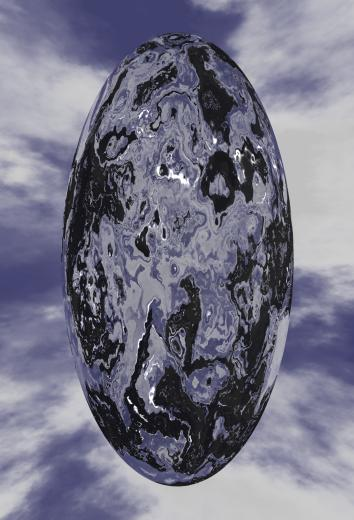

# Welcome

Welcome to __Memchan__.

This package provides commands implementing memory channels for Tcl, i.e. channels storing the data
placed into them in memory instead of on disk.

#  License

The license is MIT/BSD

# Ticket Tracking

Memchan is currently available from three repositories:

  - The [primary fossil repository](https://core.tcl-lang.org/akupries/memchan), which is also where
    the   [official ticket tracker](https://core.tcl-lang.org/akupries/memchan/reportlist) lives.

  - A [github mirror](https://github.com/andreas-kupries/memchan) updated from the primary, roughly
    once a day.

    __Please do not submit tickets at the mirror__.

    Note that you may be reading this README at the mirror.

  - And a [fossil mirror](https://chiselapp.com/user/andreas_kupries/repository/memchan/index) at
    [Chiselapp](https://chiselapp.com), also updated from the primary roughly once a day.

# Guides and other Documentation

To come.
